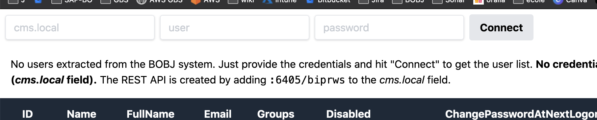
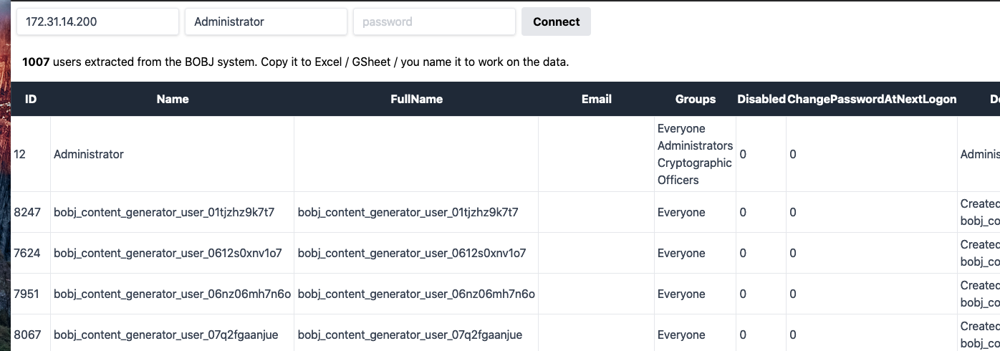

# Bobj Toolbox

Small set of tools for SAP Business Objects BI4 platform managed by the [bobj-board](https://bobj-board.org) community. It can:

* list the users and the groups related to each user on the platform
# Getting Started

Go to the url of the application [here](http://tools.bobj-board.org/).

Provide your BOBJ dns (where your REST api is hosted, it is just adding `:6405/biprws` to generate the API endpoint), your BOBJ user and your BOBJ password (currently it work only using Enterprise authentication)



Then click on **Connect**. It will call the right endpoint directly from your computer (no BOBJ data is sent over internet), and populate the user and group table below.



Then you can use the extracted data within any tool you want (copy paste to Excel for example).
## Motivation of the tool ?

I have created by the past a similar tool ([BOXI UserList & Group Extraction](https://bobj-board.org/t/boxi-userlist-group-extraction/89434)) based on Microsoft Excel, using VBA to consume BOBJ API. Today I do not have anymore Office on my laptop but still working with BOBJ, and I have some skills in frontend development using React.js. It’s an opportunity to test such application that does not rely on any backend (except your BOBJ REST API) 

## Questions ?


> Let me know in this [thread](https://bobj-board.org/t/bobj-bi4-2-user-list-and-group-extraction-via-spa/256347) if this tool have helped you, if you have any issue with it. Thanks for your feedback, I will look forward to enhance it !

* **BOBJ version**: The tool have been tested on BI4.2 SP7 and SP8. I think it work starting from BI4.2 SP0.
* **Tracker**: A Google Analytics tracker is installed to let me know how many user have used the tool, and how many fail/success login it generate. The tracker does not not track any BOBJ related information (system, user, password, user or group extracted)
* **Source Code**: available [here](https://github.com/business-objects-board/bobj-toolbox)


# Develop on this tool ?

The application is created around the [ReactJs](https://reactjs.org) framework, using the [create-react-app](https://create-react-app.dev/) skeleton. `node` and `yarn` must be installed on your local computer.

To develop on the application you can run:

```
yarn install
yarn start
```

Then go to `http://localhost:3000`

## Running the tests

There is currently no tests. I accept `pull requests` on this subject if you can help me 👌.

## Deployment

As the application is frontend only, whitout any backend component, it's easy to deploy. I have choosen to deploy it on [surge.sh](https://surge.sh) which is allowing free static hosting, but you can try to host it where you want.

There is a script in `package.json` file that simplify the deployment:

```
yarn deploy
```

## Built With

- [ReactJs](https://reactjs.org) - The Js framework
- [tailwindcss](https://tailwindcss.com/) - the best CSS toolkit ;)
- [Business Objects REST SDK](https://help.sap.com/viewer/product/SAP_BUSINESSOBJECTS_BUSINESS_INTELLIGENCE_PLATFORM/4.3.1/en-US) - The BOBJ api used

# Contributing

You are welcome to contribute to this project. You can first open an [issue](https://github.com/business-objects-board/bobj-toolbox/issues) if you encounter an issue with the tool.

You can also provide [pull requests](https://github.com/business-objects-board/bobj-toolbox/pulls). It will be merged after check if it add a functionality or fix an issue.

# Authors

- **Julien Bras** - *Initial work* - [bobman38](https://github.com/bobman38)

See also the list of [contributors](https://github.com/business-objects-board/bobj-toolbox/contributors) who participated in this project.

# License

This project is licensed under the MIT License - see the [LICENSE.md](LICENSE.md) file for details
